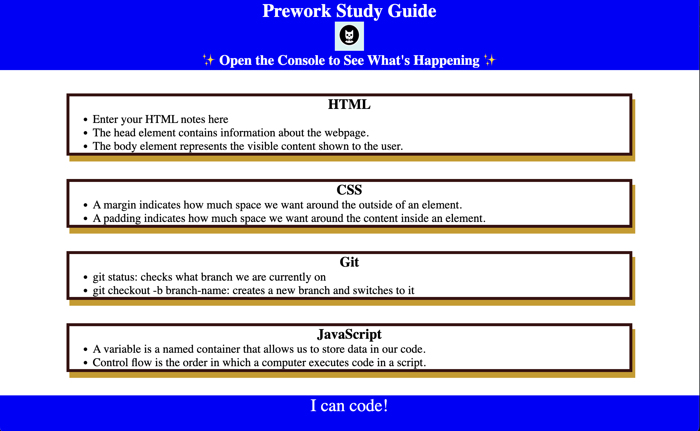

# <Your-Project-Title>

## Description

- To become more well rounded programmer/developer
- I built this project to learn the basics of Full Stack development
- I learned basics of HTML, CSS, and JavaScript

## Installation

N/A

## Usage

To use this Prework Study Guide, you can review the notes in each section.  
For suggestions on what to study first, open the Chrome DevTools by pressing Command+Option+I (macOS) or Control+Shift+I (Windows). 
A console panel should open either below or to the side of the webpage in the browser.  
There you will see a list of topics we learned from the prework along with a suggestion on which topic to study first. 

## Credits

Me

## License

Please refer to the LICENSE in the repo.
